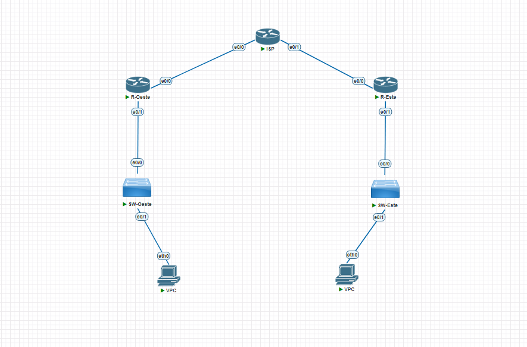
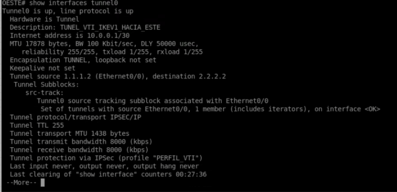
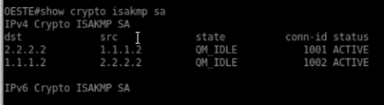
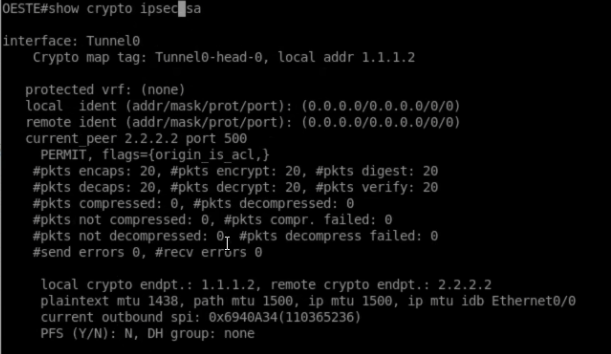
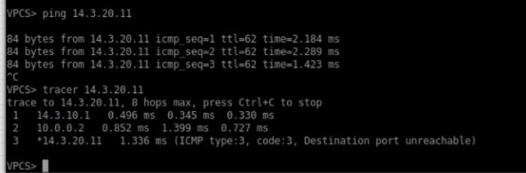

<h1>Instituto Tecnológico de Las Américas (ITLA)</h1>
  
<h2>Configuración y Verificación de VPN Site-to-Site Basada en Enrutamiento (IPSec IKEv1 VTI)</h2>

Documentación Técnica Profesional — Práctica 5 (Semana 6)

   

<strong>Estudiante:</strong> Alan Daniel Garcia Mendez 
<strong>Matrícula:</strong> 2025-1403 
<strong>Carrera:</strong> Seguridad Informática 
<strong>Asignatura:</strong> Seguridad de Redes 
<strong>Docente:</strong> Jonathan Esteban Rondon Corniel 
<strong>Fecha de Entrega:</strong> 2 de julio de 2026 
<strong>Video de Exposición:</strong> <a href="https://youtu.be/g-DizA9DKnY">https://youtu.be/g-DizA9DKnY</a> 
<strong>Repositorio de GitHub:</strong> <a href="https://github.com/imAlanG16/02_ipsec_ikev1_route_s2s">https://github.com/imAlanG16/02_ipsec_ikev1_route_s2s</a>

## Objetivo de la VPN
El propósito de esta configuración es implementar un enlace VPN Site-to-Site basado en enrutamiento (Route-based) utilizando interfaces lógicas de túnel virtual (Virtual Tunnel Interfaces - VTI) aseguradas con IPSec IKEv1. A diferencia de las VPNs basadas en políticas, este modelo crea interfaces lógicas virtuales directas (`Tunnel0`) donde todo el tráfico enrutado hacia la interfaz es automáticamente encriptado. Esto permite simplificar la administración del enrutamiento al desacoplar la seguridad (IPSec) de las tablas de rutas y habilitar el soporte para tráfico de broadcast, multicast y protocolos de enrutamiento dinámico sobre el enlace seguro.

## Topología de Red y Direccionamiento
La topología física de tránsito es equivalente al diseño Site-to-Site anterior. Sin embargo, lógicamente se añade una subred lógica de túnel `10.0.0.0/30` para la conexión directa punto a punto entre los extremos virtuales de R-Oeste y R-Este.

  
  
Topología física Site-to-Site utilizada en la práctica

El direccionamiento configurado para las interfaces de red físicas y virtuales es el siguiente:

| Dispositivo / Rol | Interfaz | Dirección IP / Subred | Descripción |
| :--- | :--- | :--- | :--- |
| **Router OESTE (Peer 1)** | Ethernet0/0 | `1.1.1.2/30` | WAN física hacia ISP |
| | Ethernet0/1 | `14.3.10.1/24` | LAN interna corporativa |
| | Tunnel0 | `10.0.0.1/30` | Interfaz lógica Tunnel VTI |
| **Router ESTE (Peer 2)** | Ethernet0/0 | `2.2.2.2/30` | WAN física hacia ISP |
| | Ethernet0/1 | `14.3.20.1/24` | LAN interna corporativa |
| | Tunnel0 | `10.0.0.2/30` | Interfaz lógica Tunnel VTI |

## Parámetros Criptográficos Utilizados
Los parámetros de seguridad empleados en las fases ISAKMP e IPSec son:

| Fase | Parámetro | Valor Configurado |
| :--- | :--- | :--- |
| **Fase 1 (ISAKMP)** | Versión IKE | IKEv1 |
| **Fase 1** | Algoritmo de Cifrado | AES-256 |
| **Fase 1** | Función Hash | SHA-256 |
| **Fase 1** | Autenticación / PSK | Pre-share / `CISCO123` |
| **Fase 1** | Grupo Diffie-Hellman | Group 14 (2048-bit) |
| **Fase 2 (IPSec)** | Transform-Set | `TS_VTI_IKEV1` (`esp-aes 256 esp-sha256-hmac`) |
| **Fase 2** | Modo de Operación | Tunnel Mode (`mode tunnel`) |
| **Fase 2** | Asociación | Perfil IPSec (`PERFIL_VTI`) aplicado directamente al Túnel |

## Explicación de la Configuración y Scripts
En este diseño, ya no se utiliza una lista de acceso para interceptar las redes LAN. En su lugar, el transform-set se vincula a un perfil de IPSec (`crypto ipsec profile PERFIL_VTI`). Este perfil se aplica como protección directa a la interfaz virtual Tunnel0 (`tunnel protection ipsec profile PERFIL_VTI`). El enrutamiento entre las redes LAN se realiza simplemente asociando una ruta estática que apunta a la IP del peer del túnel (`ip route 14.3.20.0 255.255.255.0 10.0.0.2`).

Los scripts de configuración se encuentran guardados en la carpeta de recursos de este entregable: [script_configuracion.txt](resources/script_configuracion.txt).

## Verificación de Funcionamiento

### 1. Estado y Operatividad del Túnel Virtual (Tunnel0)
Para confirmar la creación de la interfaz lógica VTI, se ejecuta el comando `show interfaces tunnel0` en el router `OESTE`. La salida de consola ratifica que la interfaz `Tunnel0` se encuentra activa y su protocolo de línea en funcionamiento (**`up / up`**). 

Se observa el direccionamiento virtual configurado **`10.0.0.1/30`**, la definición WAN física de origen y destino (`1.1.1.2` ➔ `2.2.2.2`), y la declaración explícita de seguridad: **`Tunnel protection via IPSec (profile "PERFIL_VTI")`**.

  
  
Detalles de la interfaz virtual Tunnel0 en OESTE mostrando la protección IPSec activa

### 2. Estado de la Negociación ISAKMP SA (Fase 1)
La comprobación de la Fase 1 se realiza mediante el comando `show crypto isakmp sa` en el router `OESTE`. La salida registra las asociaciones activas establecidas bidireccionalmente hacia el peer público remoto `2.2.2.2`. 

Ambas asociaciones se reportan en el estado estable **`QM_IDLE`** y estatus **`ACTIVE`**, asegurando el intercambio correcto de llaves e identidades ISAKMP bajo IKEv1.

  
  
Estado ISAKMP SA en el router OESTE confirmando la conectividad de Fase 1 activa

### 3. Asociación de Seguridad IPSec en la Interfaz de Túnel (Fase 2)
Al ejecutar el comando `show crypto ipsec sa` en el router `OESTE`, se verifica el estado criptográfico de la interfaz Tunnel0. Cabe destacar que, al tratarse de una VPN basada en enrutamiento con VTI, las identidades de red protegidas (`local ident` y `remote ident`) se definen de manera global como **`(0.0.0.0/0.0.0.0/0/0)`** hacia cualquier puerto y protocolo. Esto significa que todo tráfico inyectado hacia la interfaz virtual es cifrado automáticamente por el perfil sin depender de una ACL de control estática.

La salida muestra contadores activos confirmando el cifrado de datos:
* **`#pkts encaps: 20`** y **`#pkts encrypt: 20`**
* **`#pkts decaps: 20`** y **`#pkts decrypt: 20`**

Esto valida que 20 tramas de datos han sido cifradas y descifradas de extremo a extremo a través de la VTI.

  
  
Estadísticas de la SA IPSec de Tunnel0 en OESTE mostrando la delegación total del tráfico en el túnel

### 4. Prueba de Conectividad y Enrutamiento LAN a LAN (Traceroute VTI)
La verificación de tráfico de extremo a extremo se realiza desde el host VPCS corporativo en el extremo Oeste. Al enviar tráfico hacia la IP del host en la LAN remota Este (`14.3.20.11`), se obtiene una conectividad exitosa con **0% de pérdida**.

Además, al trazar la ruta mediante el comando `tracer 14.3.20.11`, se documenta detalladamente el comportamiento del enrutamiento de túnel:
1. El primer salto se dirige al gateway de la LAN local `14.3.10.1` (interfaz del router Oeste).
2. El segundo salto transita directamente a través del extremo virtual del túnel remoto **`10.0.0.2`** (interfaz Tunnel0 del router Este). Esto comprueba que el enrutamiento lógico funciona perfectamente y que el tráfico está siendo encauzado e indexado hacia el túnel virtual seguro.
3. El tercer salto alcanza al host de destino `14.3.20.11` a través del direccionamiento LAN remoto.

  
  
Prueba de conectividad desde VPCS validando el paso explícito por la IP del túnel virtual 10.0.0.2

